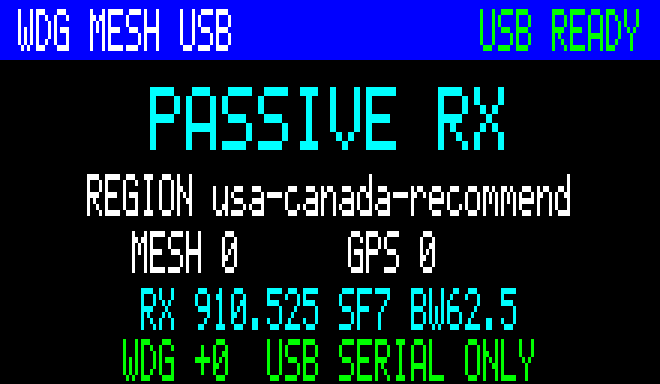

# Canadaverse WDG Mesh Serial Sidecar

A passive MeshCore receiver for WDG wardrives. The radio needs only USB: it has
no Wi-Fi setup, BLE service, WDG credential, or Internet client. A small
Windows/Linux bridge selects the MeshCore region, receives live geolocated
adverts over serial, and uploads them to WDG.

```text
MeshCore RF -> sidecar (passive RX) -> USB serial -> Windows/Linux -> WDG
Wi-Fi wardriver/Biscuit Pro -------------------------------> WDG separately
```

The sidecar complements a Biscuit Pro or other Wi-Fi wardriver. It never scans
Wi-Fi and does not need a Biscuit Manager connection.

This is a standalone project. It does not replace or modify the separate
[Wi-Fi/BLE sidecar firmware](https://github.com/n30nex/Canadaverse-WDG-Mesh-Sidecar).

## Supported builds

| Target | Hardware | UI | Current evidence |
| --- | --- | --- | --- |
| `rcc6_wdg_serial` | Heltec RCC6 prototype | 220x128 TFT | Hardware-qualified: exact ESP32-C6 flash, WDG1 handshake, Canada radio READY, framebuffer capture |
| `heltec_v3_wdg_serial` | Heltec WiFi LoRa 32 V3 | 128x64 OLED | Builds |
| `heltec_v4_wdg_serial` | Heltec WiFi LoRa 32 V4/V4.3 | 128x64 OLED | Builds; V4 pin/FEM base previously qualified |
| `rak4631_wdg_serial` | RAKwireless WisBlock RAK4631 | Headless | Builds from upstream MeshCore pin map |
| `heltec_tracker_wdg_serial` | Heltec Wireless Tracker | Headless | Builds from upstream MeshCore pin map |
| `rc52_wdg_serial` | Heltec RadioCore RC52-L62/SX1262 | 220x128 NV3001B TFT | Experimental; uses the qualified NeonPocket RC52 pin map |

“Builds” is not a claim of physical qualification. Do not publish a stable
image for a board until its USB handshake and radio receive path are tested on
that exact hardware.



## Safety model

- Receives signed MeshCore adverts and emits only adverts containing valid,
  non-zero latitude/longitude.
- The firmware radio adapter cannot transmit. It sends no advert, guest login,
  neighbour request, acknowledgement, or forwarded packet.
- The WDG API key exists only on the host, normally in Windows Credential
  Manager or the Linux desktop secret service. It is never sent over serial.
- The host keeps observations only in RAM. There is no database, history scan,
  catch-up, backfill, or persistent upload queue.
- A node is attempted at most once per bridge process. A batch is consumed
  before its HTTP POST; an uncertain response is never automatically replayed.
- Pending observations are discarded if the serial link drops.
- The device emits records only while a WDG-authenticated host renews a
  15-second serial lease.

Repeater neighbour polling is intentionally absent. Its response contains
node IDs, age, and signal data—not GPS—so polling would add RF transmissions
without creating eligible WDG locations.

## Windows/Linux setup

Flash the exact image for the attached board, connect it by USB, then run:

```text
python setup_bridge.py
```

An installer or administrator may preselect only the non-secret choices while
leaving the API key prompt hidden, for example:

```text
python setup_bridge.py --port COM21 --region usa-canada-recommended
```

The guided setup:

1. Lists serial devices and asks you to select the sidecar explicitly.
2. Downloads the current official MeshCore radio presets and asks for a region.
3. prompts for the WDG API key with hidden input.
4. validates WDG authentication and the sidecar serial handshake.
5. stores only the selected USB identity and region in a local JSON file.
6. stores the API key in the operating-system credential vault.

It never accepts an API key as a command-line option. If a secure Linux keyring
is unavailable, the bridge fails rather than writing plaintext; an unattended
service may instead inject `WDG_API_KEY` into that process environment using
the OS service manager's secret facility.

Run the live bridge on Windows:

```text
.venv\Scripts\python tools\wdg_mesh_bridge.py run
```

Or install the Windows background bridge and system-tray start/stop icon:

```text
powershell.exe -NoProfile -ExecutionPolicy Bypass -File tools\windows_background.ps1 -Install
```

Both start at Windows logon. Right-click the tray icon to start, stop, or
restart the bridge; double-click it to show status. The scheduled task command
contains no API key—the bridge continues to read it from Windows Credential
Manager.

To swap radios, stop the background bridge, connect the replacement running its
matching serial-sidecar firmware, and run:

```text
.venv\Scripts\python tools\wdg_mesh_bridge.py select-device --port COM22
```

Use the replacement's actual port. The command verifies the radio and WDG
authentication before saving its USB identity. It retains the existing region
and credential-vault key. Restart the background bridge after selection.

Or on Linux:

```text
.venv/bin/python tools/wdg_mesh_bridge.py run
```

Useful safe commands:

```text
.venv\Scripts\python tools\wdg_mesh_bridge.py status
.venv\Scripts\python tools\wdg_mesh_bridge.py run --dry-run
.venv\Scripts\python tools\wdg_mesh_bridge.py forget-key
.venv\Scripts\python tools\wdg_mesh_bridge.py self-test
```

Dry-run still validates WDG authentication and uses live RF, but performs no
POST. Keep the bridge running during the wardrive; the radio itself has no
Internet path.

## Release images

GitHub Actions publishes every supported target. ESP32 targets include an app
image and a one-file `-factory.bin`; write the factory image at address `0x0`
for a clean USB flash. The RAK4631 target includes both Intel HEX and its
bootloader-ready `-nrfutil.zip` package. Always choose the image whose board
name exactly matches the attached hardware.

RC52 also uses application-only nRF52 HEX/nrfutil (S140 6.1.1, application
start `0x26000`). Preserve its bootloader, SoftDevice and MeshCore storage.
The collector keeps observations in RAM and does not mount or rewrite the
existing MeshCore filesystem. RC52's TFT uses SPI1 at 8 MHz; LoRa uses SPI.

## What WDG receives

The bridge uses WatchDogsGo's existing signed upload envelope and submits:

```json
{
  "networks": [],
  "aircraft": [],
  "meshcore_nodes": [
    {
      "node_id": "01020304",
      "node_type": "Repeater",
      "name": "example",
      "lat": 43.6532,
      "lon": -79.3832,
      "rssi": -92.0,
      "first_seen": "2026-08-20T12:00:00",
      "type": "MESHCORE"
    }
  ]
}
```

`first_seen` is the host receipt time, not an untrusted radio timestamp.

## Build

Install PlatformIO Core and run `pio run` for the full matrix, or one target:

```text
pio run -e rcc6_wdg_serial
pio run -e heltec_v3_wdg_serial
pio run -e heltec_v4_wdg_serial
pio run -e rak4631_wdg_serial
pio run -e heltec_tracker_wdg_serial
pio run -e rc52_wdg_serial
```

ESP32 targets produce `firmware.bin`. RAK4631 produces `firmware.hex` and an
`nrfutil` `firmware.zip`. CI publishes board-named artifacts and SHA-256 sums.

For a wired ESP32 development flash, resolve the exact USB identity and port
first, then substitute that verified port:

```text
pio run -e rcc6_wdg_serial -t upload --upload-port COM21
```

Never infer a board generation from a remembered COM port. RAK4631 uses its
nRF52 bootloader/nrfutil flow rather than an ESP32 image.

## Serial protocol

The line-oriented protocol is deliberately small:

```text
host -> WDG1 HELLO
host -> WDG1 AUTH OK
host -> WDG1 START <MHz> <kHz> <SF> <CR> <epoch> <region-slug>
radio -> WDG1 READY 1 <board> <region-slug>
radio -> WDG1 {"node_id":...,"lat":...,"lon":...}
host -> WDG1 ACK <sent> <imported>
host -> WDG1 SEND UNCONFIRMED
host -> WDG1 STOP
```

`START` is renewed every five seconds. Credentials and upload signatures are
not protocol fields.

Packet identity and signature validation use pinned
[`meshcore-dev/MeshCore`](https://github.com/meshcore-dev/MeshCore) sources.
The WDG envelope follows
[`LOCOSP/WatchDogsGo`](https://github.com/LOCOSP/WatchDogsGo). Radio preset
selection comes from the official
[`api.meshcore.nz` configuration service](https://api.meshcore.nz/api/v1/config).
